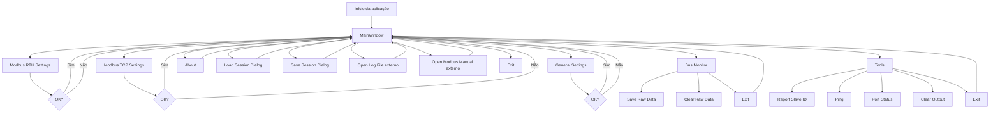
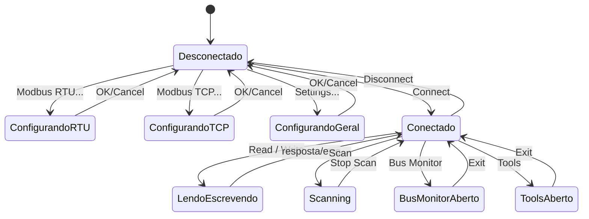

# Telas e fluxo de telas do qModMaster

## 1. Mapa geral das telas

O projeto possui uma janela principal e várias janelas auxiliares. O arquivo de projeto lista os formulários Qt usados pela aplicação: `mainwindow.ui`, `about.ui`, `settingsmodbusrtu.ui`, `settingsmodbustcp.ui`, `settings.ui`, `busmonitor.ui` e `tools.ui`.

```text
QModMaster
└── MainWindow
    ├── Modbus RTU Settings
    ├── Modbus TCP Settings
    ├── General Settings
    ├── Bus Monitor
    ├── Tools
    ├── About
    ├── Load Session
    ├── Save Session
    ├── Log File
    └── Modbus Manual
```

---

# 2. Tela principal: `MainWindow`

## Função

A `MainWindow` é a tela central do sistema. Ela concentra a operação Modbus: seleção do modo RTU/TCP, configuração do slave, função Modbus, endereço inicial, quantidade de coils/registers, formato dos dados, tabela de valores, conexão, leitura/escrita e scan periódico. A interface contém os campos `Modbus Mode`, `Slave Addr`, `Scan Rate`, `Function Code`, `Start Address`, `Number of Coils`, `Data Format`, opção `Signed`, tabela `tblRegisters` e ações como `Connect`, `Read / Write`, `Scan`, `Bus Monitor`, `Tools`, `Settings`, `Load Session`, `Save Session`, `Log File` e `Modbus Manual`.

## Componentes principais

```text
MainWindow
├── Área de comunicação
│   ├── Modbus Mode: RTU ou TCP
│   ├── Slave Addr / Unit ID
│   └── Scan Rate
│
├── Área da requisição Modbus
│   ├── Function Code
│   ├── Start Address
│   ├── Base do endereço: Dec ou Hex
│   ├── Number of Coils / Registers / Inputs
│   ├── Data Format: Bin, Dec ou Hex
│   └── Signed
│
├── Tabela de dados
│   └── tblRegisters
│
├── Toolbar
│   ├── Load Session
│   ├── Save Session
│   ├── Connect
│   ├── Read / Write
│   ├── Scan
│   ├── Clear Table
│   ├── Reset Counters
│   ├── Log File
│   ├── Bus Monitor
│   ├── Tools
│   ├── Headers
│   ├── Modbus RTU
│   ├── Modbus TCP
│   ├── Settings
│   ├── Modbus Manual
│   ├── About
│   └── Exit
│
└── Status bar
    ├── Estado da conexão
    ├── Base Addr
    ├── Packets
    └── Errors
```

---

# 3. Tela `Modbus RTU Settings`

## Função

Tela modal para configurar a comunicação serial RTU. Ela possui campos de dispositivo serial, baud rate, data bits, stop bits, parity, RTS e porta serial. Também possui botões `OK` e `Cancel`.

## Campos

```text
Modbus RTU Settings
├── Serial device
│   ├── /dev/ttyS
│   └── /dev/ttyUSB
├── Serial port
├── Baud
├── Data Bits
├── Stop Bits
├── Parity
├── RTS
├── OK
└── Cancel
```

## Fluxo

```text
MainWindow
→ Options / Toolbar
→ Modbus RTU...
→ Abre Modbus RTU Settings
    ├── OK
    │   ├── salva configurações
    │   ├── atualiza status da MainWindow
    │   └── fecha diálogo
    └── Cancel
        └── descarta alterações e fecha diálogo
```

Quando essa tela é aberta, a `MainWindow` informa ao diálogo se o Modbus está conectado. Se o usuário confirmar, as configurações são salvas; se cancelar, são rejeitadas.

---

# 4. Tela `Modbus TCP Settings`

## Função

Tela modal para configurar comunicação Modbus TCP. Ela contém os campos `Slave IP` e `TCP Port`, além de `OK` e `Cancel`.

## Campos

```text
Modbus TCP Settings
├── Slave IP
├── TCP Port
├── OK
└── Cancel
```

## Fluxo

```text
MainWindow
→ Options / Toolbar
→ Modbus TCP...
→ Abre Modbus TCP Settings
    ├── OK
    │   ├── valida/salva IP e porta
    │   ├── atualiza status da MainWindow
    │   └── fecha diálogo
    └── Cancel
        └── descarta alterações e fecha diálogo
```

Assim como no RTU, a `MainWindow` passa o estado de conexão para a tela TCP e salva as configurações somente se o usuário aceitar o diálogo.

---

# 5. Tela `Settings`

## Função

Tela modal de configurações gerais da aplicação. Ela controla timeout de resposta, número máximo de linhas do Bus Monitor e endereço base.

## Campos

```text
Settings
├── Response Timeout (sec)
├── Max No Of Bus Monitor Lines
├── Base Addr
├── OK
└── Cancel
```

## Fluxo

```text
MainWindow
→ Options / Toolbar
→ Settings...
→ Abre Settings
    ├── OK
    │   ├── salva configurações gerais
    │   ├── atualiza timeout do ModbusAdapter
    │   ├── atualiza limite do RawDataModel
    │   ├── atualiza endereço mínimo da MainWindow
    │   └── fecha diálogo
    └── Cancel
        └── descarta alterações e fecha diálogo
```

Ao confirmar essa tela, a aplicação atualiza o limite de linhas do Bus Monitor, o timeout usado pelo adapter Modbus e o valor mínimo do campo `Start Address`.

---

# 6. Tela `Bus Monitor`

## Função

Janela auxiliar não modal usada para observar e interpretar o tráfego Modbus. Ela contém uma área de `Raw Data`, uma área de `ADU` e ações `Clear`, `Exit` e `Save`.

## Estrutura

```text
Bus Monitor
├── Raw Data
│   └── lista de mensagens Sys / Tx / Rx
│
├── ADU
│   └── interpretação da mensagem selecionada
│
└── Toolbar
    ├── Save
    ├── Clear
    └── Exit
```

## Fluxo de abertura

```text
MainWindow
→ View / Toolbar
→ Bus Monitor
→ Abre Bus Monitor ao lado da MainWindow
```

A `MainWindow` posiciona o Bus Monitor ao lado da janela principal e atualiza o limite máximo de linhas antes de exibi-lo.

## Fluxo de uso

```text
Usuário conecta Modbus
→ Executa Read / Write ou Scan
→ ModbusAdapter captura mensagens Tx/Rx
→ RawDataModel recebe linhas brutas
→ Bus Monitor exibe linhas
→ Usuário seleciona uma linha
→ Tela interpreta ADU/PDU
```

## Ações

```text
Save
→ abre diálogo de arquivo
→ salva conteúdo bruto do monitor

Clear
→ limpa a lista de mensagens

Exit
→ fecha o Bus Monitor
```

---

# 7. Tela `Tools`

## Função

Janela auxiliar não modal para comandos de diagnóstico. A UI da janela contém uma toolbar com `Exit`, `Exec` e `Clear`. O código adiciona dinamicamente combos para modo e comando, incluindo `RTU/TCP`, `TCP`, `Report Slave ID`, `Ping` e `Port Status`.

## Estrutura

```text
Tools
├── Combo de modo
│   ├── RTU/TCP
│   └── TCP
│
├── Combo de comando
│   ├── Report Slave ID
│   ├── Ping
│   └── Port Status
│
├── Área de saída textual
│
└── Toolbar
    ├── Exec
    ├── Clear
    └── Exit
```

## Fluxo de abertura

```text
MainWindow
→ Toolbar / Commands
→ Tools
→ Abre Tools ao lado da MainWindow
```

A `MainWindow` posiciona a janela `Tools` ao lado da janela principal.

## Fluxo interno

```text
Tools
→ Usuário escolhe modo
    ├── RTU/TCP
    │   └── comando disponível: Report Slave ID
    └── TCP
        ├── Report Slave ID
        ├── Ping
        └── Port Status

→ Usuário clica Exec
    ├── Report Slave ID
    │   └── executa diagnóstico Modbus
    ├── Ping
    │   └── executa ping no IP configurado
    └── Port Status
        └── tenta conexão TCP no IP:porta configurado
```

## Ações

```text
Exec
→ executa comando selecionado

Clear
→ limpa saída textual

Exit
→ fecha a janela Tools
```

---

# 8. Tela `About`

## Função

Tela modal/informativa aberta pelo menu ou toolbar. A `MainWindow` instancia `About` e conecta a ação `About...` diretamente ao método `show()` da janela.

## Fluxo

```text
MainWindow
→ Help / Toolbar
→ About...
→ Abre About
→ Usuário fecha a janela
```

---

# 9. Diálogos de sessão

## 9.1 `Load Session`

Não é uma tela `.ui` própria; é um diálogo padrão de arquivo do Qt acionado pela ação `Load Session...`.

```text
MainWindow
→ File / Toolbar
→ Load Session...
→ Abre diálogo de seleção de arquivo
→ Usuário escolhe arquivo .ses
→ Sistema carrega:
    ├── Modbus Mode
    ├── Slave ID
    ├── Scan Rate
    ├── Function Code
    ├── Start Address
    ├── Number of Coils/Registers
    └── Data Format
→ MainWindow atualiza campos
```

A ação `Load Session...` está presente na interface principal e é conectada ao slot `loadSession()`.

## 9.2 `Save Session`

Também usa diálogo padrão de arquivo.

```text
MainWindow
→ File / Toolbar
→ Save Session...
→ Abre diálogo para escolher destino
→ Sistema salva estado atual da operação
→ Fecha diálogo
```

## A ação `Save Session...` está presente na interface principal e é conectada ao slot `saveSession()`.

# 10. Telas externas abertas pelo sistema

## 10.1 `Log File`

Não é uma tela interna Qt. A ação abre o arquivo `QModMaster.log` usando `QDesktopServices`.

```text
MainWindow
→ View / Toolbar
→ Log File
→ Sistema operacional abre QModMaster.log
```

## 10.2 `Modbus Manual`

Também não é uma tela interna. A ação abre o arquivo local `ManModbus/index.html` usando `QDesktopServices`.

```text
MainWindow
→ Help / Toolbar
→ Modbus Manual
→ Sistema operacional abre ManModbus/index.html
```

---

# 11. Fluxo principal da aplicação

```text
Início
→ MainWindow
    ├── Carrega configurações salvas
    ├── Inicializa tabela
    ├── Desabilita Read / Write
    ├── Desabilita Scan
    └── Mostra status desconectado
```

Depois disso, o usuário normalmente segue um destes fluxos:

---

## 11.1 Fluxo RTU

```text
MainWindow
→ Seleciona Modbus Mode = RTU
→ Abre Modbus RTU Settings
→ Configura serial
→ OK
→ Informa Slave Addr
→ Escolhe Function Code
→ Define Start Address
→ Define quantidade
→ Escolhe Data Format
→ Connect
→ Read / Write
    └── atualiza tblRegisters
```

---

## 11.2 Fluxo TCP

```text
MainWindow
→ Seleciona Modbus Mode = TCP
→ Abre Modbus TCP Settings
→ Configura Slave IP e TCP Port
→ OK
→ Informa Unit ID
→ Escolhe Function Code
→ Define Start Address
→ Define quantidade
→ Escolhe Data Format
→ Connect
→ Read / Write
    └── atualiza tblRegisters
```

Quando o modo muda, o label do identificador também muda: em RTU aparece como `Slave Addr`; em TCP aparece como `Unit ID`.

---

## 11.3 Fluxo de leitura/escrita

```text
MainWindow
→ Usuário conectado
→ Seleciona função Modbus
    ├── Read Coils
    ├── Read Discrete Inputs
    ├── Read Holding Registers
    ├── Read Input Registers
    ├── Write Single Coil
    ├── Write Single Register
    ├── Write Multiple Coils
    └── Write Multiple Registers

→ Sistema ajusta:
    ├── label da quantidade
    ├── máximo permitido
    ├── se tabela é 1 bit ou 16 bits
    └── se quantidade é editável

→ Usuário clica Read / Write
→ Sistema executa transação Modbus
→ Atualiza tabela
→ Atualiza Packets / Errors
```

A troca de função altera limites da quantidade: coils até `2000`, registers até `125`, single write fixado em `1` e multiple write com mínimo `2`.

---

## 11.4 Fluxo de scan

```text
MainWindow
→ Usuário configura função, endereço e quantidade
→ Define Scan Rate
→ Clica Scan
→ Sistema inicia ciclo periódico
    ├── bloqueia campos que alteram a transação
    ├── executa requisição repetidamente
    ├── atualiza tabela
    ├── atualiza Packets
    └── atualiza Errors

→ Usuário clica Scan novamente
→ Sistema para ciclo
→ Campos são liberados
```

## A ação `Scan` está na tela principal e é conectada ao slot `modbusScanCycle(bool)`.

## 11.5 Fluxo com Bus Monitor aberto

```text
MainWindow
→ Bus Monitor
→ Janela Bus Monitor abre ao lado
→ Usuário executa Read / Write ou Scan
→ Bus Monitor recebe mensagens:
    ├── Sys
    ├── Tx
    └── Rx

→ Usuário clica numa mensagem
→ ADU/PDU é interpretada
→ Usuário pode:
    ├── Save
    ├── Clear
    └── Exit
```

---

## 11.6 Fluxo com Tools aberto

```text
MainWindow
→ Tools
→ Janela Tools abre ao lado
→ Usuário escolhe modo
    ├── RTU/TCP
    └── TCP

→ Usuário escolhe comando
    ├── Report Slave ID
    ├── Ping
    └── Port Status

→ Exec
→ Resultado aparece na saída textual
```

---

# 12. Diagrama Mermaid do fluxo de telas



---

# 13. Diagrama de estados da `MainWindow`



---

# 14. Resumo das telas por tipo

| Tela                  | Tipo               | Abre de onde       | Bloqueia a MainWindow? | Objetivo                  |
| --------------------- | ------------------ | ------------------ | ---------------------- | ------------------------- |
| `MainWindow`          | Janela principal   | Inicialização      | Não se aplica          | Operação Modbus           |
| `Modbus RTU Settings` | Dialog modal       | Options / Toolbar  | Sim                    | Configurar serial RTU     |
| `Modbus TCP Settings` | Dialog modal       | Options / Toolbar  | Sim                    | Configurar IP e porta TCP |
| `Settings`            | Dialog modal       | Options / Toolbar  | Sim                    | Configurações gerais      |
| `Bus Monitor`         | Janela não modal   | View / Toolbar     | Não                    | Monitorar tráfego Modbus  |
| `Tools`               | Janela não modal   | Toolbar / Commands | Não                    | Diagnósticos              |
| `About`               | Janela informativa | Help / Toolbar     | Parcial/provável       | Informações do app        |
| `Load Session`        | File dialog        | File / Toolbar     | Sim                    | Carregar `.ses`           |
| `Save Session`        | File dialog        | File / Toolbar     | Sim                    | Salvar `.ses`             |
| `Log File`            | Externo            | View / Toolbar     | Não                    | Abrir `QModMaster.log`    |
| `Modbus Manual`       | Externo            | Help / Toolbar     | Não                    | Abrir manual HTML         |

---

# 15. Navegação esperada para recriação

Para recriar a navegação, implemente a `MainWindow` como centro da aplicação e use este padrão:

```text
MainWindow
├── dialogs modais para configuração
│   ├── RTU Settings
│   ├── TCP Settings
│   └── General Settings
│
├── janelas não modais para apoio operacional
│   ├── Bus Monitor
│   └── Tools
│
├── diálogos nativos do sistema
│   ├── Load Session
│   └── Save Session
│
└── aberturas externas
    ├── Log File
    └── Modbus Manual
```

A lógica principal deve permanecer na `MainWindow`, que cria as janelas auxiliares, conecta as ações de menu/toolbar e controla o estado dos botões conforme conexão, função Modbus e scan.
